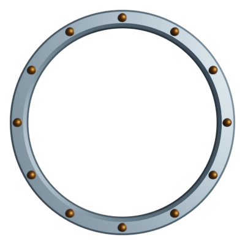

# VTT Token Frames

I've created a wide range of simple frames for use around
VTT character tokens. Each is 400x400px image, designed to
be put on top of a character portrait.

There are 16 colours and four styles, examples of which are
below:





The styles are meant to be more SciFi in nature, so have a
more mechanical look and feel.

There is a `mktoken` bash script which can be used to apply
them to a jpg file.

```
# mktoken -s studs -c sky *.jpg
001.jpg -> Tokens/001.webp
002.jpg -> Tokens/002.webp
003.jpg -> Tokens/003.webp
004.jpg -> Tokens/004.webp
005.jpg -> Tokens/005.webp
```

To run it, copy the contents of the `graphics` directory into
`/usr/local/share/tokens`, and put `mktoken` itself somewhere
on the path (e.g. `/usr/local/bin`).

Arguments:

* -w Width of tokens (defaults to 400px)
* -s Style of tokens (defaults to ring)
* -c Colour of tokens (defaults to white)

The size of the source images doesn't matter, but they must
be square.
