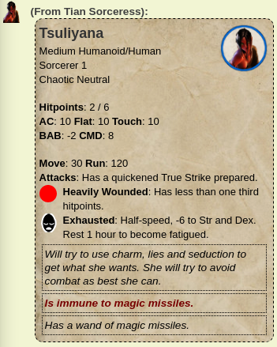

PfInfo
======

Provides information on Pathfinder characters, working in conjunction with
the _Pathfinder Character Sheet_ to determine character statistics. The
information is output to the chat window so the GM doesn't have to open
the full character sheet.

Commands
--------

**!pfhelp** - Provides help text to players and GM.

**!pfinfo** tokenId - Displays information about the selected character token in
 the chat window, whispered to the GM.

It is normally best to set up a macro which shows a token action to run the
following command:
````
!pfinfo @{selected|token_id}
````

This will output something like the following to the chat window:



**!pfsetstatus** - Sets a status on the selected tokens. The status types are
based on Pathfinder conditions, and apply a marker to the token so that the
status effect is visible. If applicable, it will also update the character
sheet as long as this is a unique character.

It is recommended that the following macro is used for this API command, since
it provides a drop down list of all the correct status types.

````
!pfsetstatus ?{What status|Bleeding|Blind|Confused|Dazzled|Entangled|Exhausted|Fatigued|Frightened|Grappled|Helpless|Invisible|Pinned|Nauseated|Panicked|Paralyzed|Prone|Shaken|Sickened|Slowed|Stabilized|Staggered|Stunned|Unconscious|Dead} ?{Value}
````

**!pfunsetstatus** - Unsets the specified status from the selected tokens.

As with the set status command, it is recommended that a macro is used.

````
!pfunsetstatus ?{What status|Bleeding|Blind|Confused|Dazzled|Entangled|Exhausted|Fatigued|Frightened|Grappled|Helpless|Invisible|Pinned|Nauseated|Panicked|Paralyzed|Prone|Shaken|Sickened|Slowed|Stabilized|Staggered|Stunned|Unconscious|Dead}
````

Advanced
--------

The basic statistics that are shown are relatively straightforward, and are
simply pulled directly from the character sheet. There are other assumptions
that are made about the use of note fields, status symbols and the like, which
provide further information.

Some of this comes from the character, some of it comes from the token.

Token Status
------------

Since it's mostly designed for NPCs, of which there can be many copies of
a token for a given character, most status information is pulled from the
token.

**HitPoints:** Hitpoints are held in bar3 (current hitpoints / maximum hitpoints),
and nonlethal damage is held in bar1 (nonlethal damage received). A brown status
symbol means the token is moderately wounded (taken 1/3 damage), a red one means
they are heavily wounded (2/3 damage). See the **PfCombat** API for details on this.
Green means that they are on negative hitpoints but stabilised.

Other status icons are used as follows:

| Status       | Meaning             | Description |
| ------------ | ------------------- | ----------- |
| brown        | Moderately wounded. | 2/3 hitpoints or fewer. |
| red          | Heavily wounded.    | 1/3 hitpoints or fewer. |
| green        | Stablised.          | On negative hitpoints, but not dying. |
| skull        | Unconscious.        | Negative hitpoints and unconscious. |
| dead         | Dead.               | Creature is dead, destroyed or dispersed. |
| pink         | Bleeding.           | Bleeding HP each round. |
| bleeding-eye | Blind.              | |
| screaming    | Confused.           | |
| overdrive    | Dazzled             | |
| fishing-net  | Entangled.          | |
| sleepy       | Exhausted.          | |
| half-haze    | Fatigued.           | |
| broken-heart | Frightened.         | |
| padlock      | Grappled.           | |
| ninja-mask   | Invisible.          | |
| radioactive  | Nauseated           | |
| half-heart   | Panicked.           | |
| Cobweb       | Paralyzed.          | |
| chained-heart| Shaken.             | |
| arrowed      | Prone.              | |
| drink-me     | Sickened.           | |
| pummeled     | Staggered.          | On zero hitpoints. |
| interdiction | Stunned.            | |
| fist         | Power Attack.       | Just used to aid in memory. |

The **PfCombat** API will set some of these automatically. A summery of
the Pathfinder rules for the condition will be provided for tokens that
have the right status set.

The **!pfsetstatus** API can be used to set a status manually on a token.
When this is used, a check is done to see if the hitpoints (bar3) are
directly linked to the character sheet. If they are, then the condition
flags on the character sheet are also updated where applicable.

Character Notes
---------------

If the `GMNotes` field of the character is set, then the contents of this
will be output as a text block beneath the status values. This means the
notes field should be limited in length so as not to overwhelm the output.

If you want to include notes that don't appear in the info block, then
put '--' on a line by itself. Only content before that line will be
displayed.

Important Notes
---------------

If there's something important about a character that should be noted,
create a note (on the Notes tabe of the character sheet) with a title
of NB. The content of this note will be output in red after the character
notes, so hopefully you won't forget it in the heat of running combat.

Token Notes
-----------

Notes can be placed in the `GMNotes` field of the token, and these are
displayed at the bottom. Only text within !! delimiters will be displayed.
This is so other information can be stored here.

For example:

```
!!This orc is carrying a +2 sword!!
Orc witnessed the event so if captured alive will be able to
give information.
```

Will cause just ``This orc is carrying a +2 sword`` to be output in the
info block. Multiple entries can be included, as long as they are each
between !! delimiters.

Note that ~~ is used by **PfDescribe** to output token specific details
to players.
