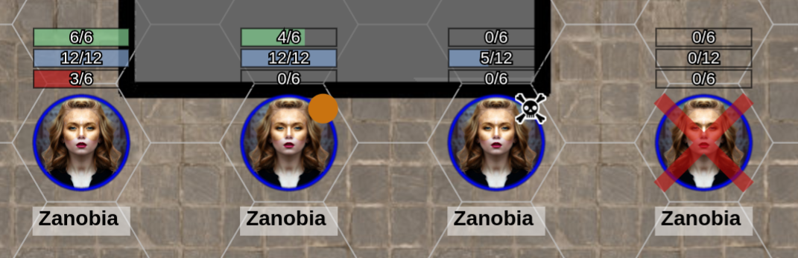
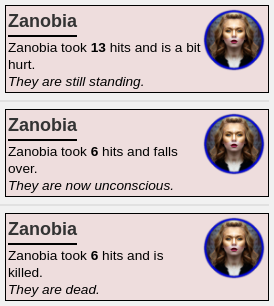

# Traveller Roll20 Scripts

API scripts for Roll20 to support Mongoose Traveller.

## describe.js

Shows descriptions of things. Based on Pathfinder script.

## combat.js

Distributes damage across multiple stats. It makes the following assumptions:

  * bar3 (red) is End
  * bar1 (green) is Str
  * bar2 (blue) is Dex
  * If this is a character, all will have Max values set for these three.
  * If Max values aren't set for bar1 and bar2, then assumes that this is a creature that just has Hits
  * If this is a creature, then bar3 is used as the Hits value. The other bars are ignored.
  * Assumes that damage is always applied to End/Hits (bar3/red).

The operations are:

  * If End is zero or Hits is 50% or less, adds an orange dot to the character.
  * If second attribute is zero, or Hits is 10% or less, then add a 'skull' icon to the character.
  * If Hits is zero, or all three attributes are zero, then kills the character with the dead marker.
  * For a character, if End is zero, further damage tries to be applied to the lowest characteristic that can take it without going to zero.




When damage occurs, a message will be output to the chat.



### List Weapon Attacks

```
!attacks
```

List all attacks that have been set up for the selected characters. If more than one 
character is currently selected, then it does it for all of them.

### Make Weapon Attacks.

```
!attack pistol
!attack laser rifle
!attack pistol +2
!attack pistol +
!attack pistol +2 -
```

Make an attack with the named weapon. The matching is case insensitive, and will try
partial matches if an exact match is not found. An exact match is preferred over a
'begins with' match, which is preferred over a 'contains in' match.

If a positive/negative modifier is present, this will be used as a DM to the roll.

If a + or - is present, then a Boon or Bane will be used for the die roll. Boons and Banes
can be combined with a DM. It uses 3d6k2 or 3d6kl2 as the die rolls for boons and banes,
so Roll20 will calculate it correctly.

### List Skills

```
!skills
```

You can list the skills that the character has defined on their character sheet. Only those
skills marked to be shown will be listed. Clicking on a skill will roll it using the set
characteristic. You can't set boons or DMs this way.

### Skill Rolls

You can make a skill roll direct from the chat window, or using a macro. This has the
added advantage over the character sheet in that you can specify the characteristic to
use at roll time.

```
!skill DEX Stealth
!skill i recon +2
```

Characteristic and skill names are case insensitive. The characteristic will match against
the first matching characteristic, so "i", "in". "int", "intellect" all match against
Intellect. Note that EDU will match before END, since more skills probably use EDU.

As with attack rolls, you can apply DMs and Boon/Bane suffixes.

If a skill has specialities, all the specialities will be show as well, with their totals.

When matching skill names, the following order is tried:
  * Look for an exact match first.
  * Then look for a match for the first part of the skill name (starts with).
  * Then look for a match in any part of the skill name (contains in).
  
So:
  * "i" will match to "Investigate", and "x" will match to "Explosives"
  * "gun" will match to "Gunner", not "Gun Combat"
  * "combat" will match to "Gun Combat"
  * "sur" will match to "Survival"

### Reactions

You can mark a token as having 'reacted' this turn.

```
!react
!react 0
```

The first will add (if it doesn't already exist) a blue dot on the token with a value
of 1, or increment the value if it is there already. Passing an integer as a parameter
will set the marker to the value give - zero will clear it.

This is applied as a penalty to all skill and attack checks made using the API commands
above.

You can use `!react` whenever the token takes a dodge, parry or similar reaction action.
You can then use `!react 0` to reset the count after it's finished its turn.

### Names

You can automatically name tokens if you have a lot of them. For example, if 6 security
guards turn up to see who has been causing explosions, rather than have six copies of
a token called "Security" you can use this command to rename them.

```
!name
```

This will give each token a unique name, using a #1, #2, #3 suffix etc. Select all the
tokens that you want to rename, and run the command.

If the token is a multi-sided token, then each one will be changed to be a different
side. If there aren't enough sides, then the sequence will be repeated.

